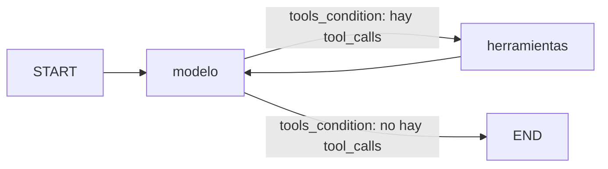

# Agente de razonamiento cíclico con memoria persistente

Agente ReAct asíncrono con LangGraph. Responde consultas de clientes y pedidos sobre una base simulada. El LLM (`gpt-4o-mini`, vinculado con `llm.bind_tools(herramientas)`) decide en cada paso si llama a una herramienta o si responde. El `StateGraph(MessagesState)` alterna entre el nodo `modelo` y el nodo `herramientas` mediante `tools_condition`. `AsyncSqliteSaver` guarda cada conversación por `thread_id` en `checkpoints.sqlite`.

Traza real (`traza_ejecucion.log`, generada con `python main.py` contra OpenAI):

```
Usuario: "¿Cuántos pedidos tuvo Ana García y cuál fue el total?"
→ El agente decide usar la herramienta: buscar_cliente_por_nombre(nombre='Ana García')
→ La herramienta devuelve: {"nombre": "Ana García", "cliente_id": 102}
→ El agente razona: todavía le falta un dato → llama otra herramienta.
→ El agente decide usar la herramienta: buscar_pedidos(cliente_id=102)
→ La herramienta devuelve: {"cliente_id": 102, "pedidos": 3, "total": 14500}
→ El agente razona: ya tiene los datos → responde.
Respuesta: "Ana García tuvo un total de 3 pedidos y el monto total gastado es de $14.500."

Usuario: "¿Y el último?"          (mismo thread_id: conversacion-demo-1)
→ El agente decide usar la herramienta: buscar_ultimo_pedido(cliente_id=102)
→ La herramienta devuelve: {"cliente_id": 102, "pedido_id": "P-1023", "fecha": "2026-09-28", "monto": 6200, "estado": "entregado"}
→ El agente razona: ya tiene los datos → responde.
Respuesta: "El último pedido de Ana García fue el pedido ID P-1023, realizado el 28 de septiembre de 2026. El monto de este pedido fue de $6.200 y su estado es "entregado"."
```

"¿Y el último?" no nombra a ningún cliente. El `102` sale del historial que `AsyncSqliteSaver` recuperó para ese `thread_id`.

## Cómo se cumple cada criterio

### Criterios de aceptación

| Criterio | Cómo se cumple | Evidencia |
|----------|----------------|-----------|
| **Autonomía** | El LLM decide solo cuándo llamar a una herramienta: `nodo_modelo` le pasa el historial y `tools_condition` mira si la respuesta trae `tool_calls`. No hay rutas manuales `if/else` en el grafo (`agente.py`). | Turno 1 de `traza_ejecucion.log`: el modelo encadena `buscar_cliente_por_nombre` → `buscar_pedidos` sin que nadie le diga el orden · `test_multi_paso_llama_dos_herramientas_en_orden` |
| **Ciclo de Retorno** | Si una herramienta devuelve un error o información incompleta, la observación vuelve al modelo por `herramientas -> modelo`. Con "García" (incompleto) hace un segundo intento con "Ana García"; con "Roberto Sánchez" (inexistente) pide aclaraciones. Los argumentos inválidos vuelven como `ToolMessage` de error por `handle_tool_errors=True`. | Turnos `prueba_reintento_nombre_incompleto` y `prueba_error_y_aclaracion` de `traza_ejecucion.log` · `test_nombre_incompleto_hace_segundo_intento` · `test_cliente_inexistente_pide_aclaracion_sin_inventar` · `test_argumento_invalido_vuelve_como_tool_message_de_error` |
| **Resiliencia de Estado** | Con el mismo `thread_id`, el agente recuerda las interacciones previas de la sesión: `AsyncSqliteSaver` guarda cada paso en `checkpoints.sqlite`. "¿Y el último?" usa el cliente del turno anterior. Otro `thread_id` arranca vacío, y el historial sobrevive a cerrar y reabrir el archivo. | Turnos `turno_2_memoria` y `prueba_hilo_aislado` · `evidencias/05-historial-otro-proceso.txt` · `test_mismo_thread_id_recuerda_el_cliente` · `test_el_historial_sobrevive_a_cerrar_y_reabrir_sqlite` |
| **Código Limpio** | Python 3.12 (`.python-version`, `requires-python = ">=3.12"`, alias `type`), tipado estático con type hints en todas las funciones (`mypy --strict` sin errores) y gestión asíncrona con `asyncio`: `async def nodo_modelo`, `ainvoke`, `AsyncSqliteSaver` y `asyncio.run(main())`. | `evidencias/03-mypy.txt` · `evidencias/02-pytest.txt` |

### Criterios de evaluación

| Criterio | Cómo se cumple | Dónde |
|----------|----------------|-------|
| **Arquitectura del Grafo y Gestión de Estado** | `grafo = StateGraph(MessagesState)`: el estado hereda de `MessagesState`, cuyo reducer `add_messages` acumula el historial y mantiene la coherencia del diálogo. Nodo `modelo` + nodo `herramientas`, arista condicional `tools_condition` y `herramientas -> modelo` para el ciclo. El historial que ve el LLM se recorta con `trim_messages`. | `agente.py` · sección [Arquitectura del grafo](#arquitectura-del-grafo) · `tests/test_grafo.py` |
| **Integración de Herramientas y Razonamiento Multi-paso** | Tres herramientas `@tool` con docstrings descriptivos y argumentos Pydantic, que simulan consultas a una base de datos. El LLM se vincula con `llm.bind_tools(herramientas)`. La herramienta se invoca 2 veces para "¿Cuántos pedidos tuvo Ana García y cuál fue el total?" y 3 en el reintento, todo con `recursion_limit` 10. | `herramientas.py` · `agente.py` · `traza_ejecucion.json` · sección [Razonamiento multi-paso y ciclo de retorno](#razonamiento-multi-paso-y-ciclo-de-retorno) |
| **Persistencia con SqliteSaver** | `AsyncSqliteSaver.from_conn_string("checkpoints.sqlite")` (el `SqliteSaver` asíncrono) + `thread_id` en cada invocación. `aget_state` recupera el historial, que `main.py` imprime con `pretty_print()`, y `historial.py` sigue la conversación desde otro proceso. | `agente.py` → `abrir_agente` · `historial.py` · sección [Persistencia con SqliteSaver](#persistencia-con-sqlitesaver) · `tests/test_persistencia.py` |
| **Calidad del Repositorio y Entorno Profesional** | Módulos separados por responsabilidad, dependencias fijadas en `requirements.txt` (venv), pytest con dobles del LLM sin API real y errores controlados por familia. Las credenciales salen de variables de entorno: `.env.example` vacío, `.env` en `.gitignore` y ninguna clave con valor por defecto. | Secciones [Archivos del repositorio](#archivos-del-repositorio), [Código y entorno](#código-y-entorno) y [Manejo de errores personalizados](#manejo-de-errores-personalizados) |

### Errores comunes a evitar

| Error | Cómo se evita |
|-------|---------------|
| **Descripciones Vagas** | Cada docstring dice cuándo usar la herramienta, cuándo no, qué recibe, qué devuelve y qué hacer con cada `ERROR`. Un docstring que no alcanzaba se corrigió: ver [Herramientas](#herramientas). |
| **Bucles Infinitos** | Cada invocación lleva `"recursion_limit": 10`, con techo de 50 en la validación Pydantic. Al alcanzarlo, `GraphRecursionError` se convierte en `LimiteRecursionError` (`test_recursion_limit_corta_el_bucle`). |
| **Estado Sucio** | `trim_messages` limita lo que ve el LLM a los últimos `max_mensajes` (default 20), y `main.py` limpia sus `thread_id` con `borrar_hilos` antes de cada corrida. |

## Quick path

1. Entorno con Python 3.12 y venv. `requirements.txt` trae también `pytest`, `pytest-asyncio` y `mypy`, así que un solo `pip install` alcanza.

**Windows (PowerShell):**

```powershell
py -3.12 -m venv .venv
Set-ExecutionPolicy -Scope Process -ExecutionPolicy Bypass
.\.venv\Scripts\Activate.ps1
pip install -r requirements.txt
Copy-Item .env.example .env
```

**Linux/macOS (bash/zsh):**

```bash
python3.12 -m venv .venv
source .venv/bin/activate
pip install -r requirements.txt
cp .env.example .env
```

1. Cargar `OPENAI_API_KEY` en `.env`. El archivo no se versiona. Para usar Anthropic: `LLM_PROVIDER=anthropic` y `ANTHROPIC_API_KEY`.
2. Chequeo sin API, tests y tipos:

```
python validacion.py
python -m pytest -v
python -m mypy .
```

1. Demo con el LLM real y recuperación del historial desde otro proceso:

```
python main.py
python historial.py conversacion-demo-1
python historial.py conversacion-demo-1 "¿En qué estado está ese pedido y cuánto salió?"
```

`main.py` escribe `traza_ejecucion.json` y `traza_ejecucion.log`. `historial.py` abre `checkpoints.sqlite` en un proceso nuevo, imprime el `thread_id` con `pretty_print()` y, si recibe una pregunta, la responde con ese contexto.

## Archivos del repositorio


| Artefacto                                                                                                         | Dónde está                                                                                                          |
| ----------------------------------------------------------------------------------------------------------------- | ------------------------------------------------------------------------------------------------------------------- |
| `grafo = StateGraph(MessagesState)`, nodos `modelo` y `herramientas`, `tools_condition`, `herramientas -> modelo` | `agente.py`                                                                                                         |
| `async def nodo_modelo`: reintentos 429/red, salida truncada, recorte del historial                               | `agente.py`                                                                                                         |
| `llm_con_herramientas = llm.bind_tools(herramientas)`                                                             | `agente.py` → `obtener_llm_con_herramientas`                                                                        |
| `AsyncSqliteSaver.from_conn_string(ruta_db)` y `grafo.compile(checkpointer=checkpointer)`                         | `agente.py` → `abrir_agente`                                                                                        |
| `preguntar`: `thread_id`, `recursion_limit` (default 10) y validación Pydantic                                    | `agente.py`                                                                                                         |
| `@tool` `buscar_cliente_por_nombre`, `buscar_pedidos`, `buscar_ultimo_pedido`, y `CLIENTES_DB` / `PEDIDOS_DB`     | `herramientas.py`                                                                                                   |
| `crear_llm` (`ChatOpenAI` o `ChatAnthropic`) y `clasificar_error`                                                 | `modelo.py`                                                                                                         |
| Familias de error                                                                                                 | `errors.py`                                                                                                         |
| `serializar_traza`, `lineas_react`, `guardar_traza`                                                               | `traza.py`                                                                                                          |
| Demo: seis turnos en cuatro `thread_id` y el historial recuperado                                                 | `main.py`                                                                                                           |
| Historial de un `thread_id` en un proceso nuevo                                                                   | `historial.py`                                                                                                      |
| Traza ReAct de la demo real                                                                                       | `traza_ejecucion.json` · `traza_ejecucion.log`                                                                      |
| Chequeo offline                                                                                                   | `validacion.py`                                                                                                     |
| Tests y dobles del LLM                                                                                            | `tests/`                                                                                                            |
| Dependencias fijadas · Python · tipos                                                                             | `requirements.txt` · `.python-version` / `pyproject.toml` (`requires-python >= 3.12`) · `[tool.mypy] strict = true` |
| Variables de entorno                                                                                              | `.env.example` (el `.env` real está en `.gitignore`)                                                                |


## Arquitectura del grafo




```python
grafo = StateGraph(MessagesState)  # hereda el reducer add_messages: cada nodo suma mensajes al historial
grafo.add_node("modelo", nodo_modelo)
grafo.add_node("herramientas", ToolNode(herramientas, handle_tool_errors=True))
grafo.add_edge(START, "modelo")
grafo.add_conditional_edges("modelo", tools_condition, {"tools": "herramientas", END: END})
grafo.add_edge("herramientas", "modelo")
```

- **Autonomía.** No hay rutas `if/else` por palabra clave. `nodo_modelo` le pasa el historial al LLM y `tools_condition` mira si la respuesta trae `tool_calls`. El orden de las llamadas lo decide el modelo leyendo los docstrings.
- **Ciclo.** `herramientas -> modelo` devuelve la observación al modelo. El modelo puede llamar otra herramienta, repetir la misma con otro argumento o responder.
- **Estado.** `MessagesState` define `messages: Annotated[list[AnyMessage], add_messages]`. `add_messages` cumple el papel de `operator.add` (concatenar) y además deduplica por `id` del mensaje: al retomar un checkpoint, el historial recuperado y el mensaje nuevo no se duplican. Los nodos no mutan el estado; devuelven `{"messages": [respuesta]}` y el reducer lo suma.
- **Estado sucio.** El checkpoint guarda todo el historial. A cada paso, `recortar_historial` (`trim_messages`) le manda al LLM solo los últimos `max_mensajes` (default 20), empezando en un `HumanMessage` para no dejar un `ToolMessage` sin su `AIMessage`. `preguntar(..., max_mensajes=...)` lo pasa por `configurable` y el valor llega al nodo. Además, `main.py` borra sus cuatro `thread_id` con `borrar_hilos` antes de correr, para que una segunda corrida no apile la demo sobre la anterior.


## Herramientas

Las dos tablas están separadas a propósito. El usuario nombra al cliente y los pedidos se buscan por ID, así que para responder hay que encadenar dos herramientas.


| Herramienta                 | Entrada (Pydantic)       | Salida                                                                   | Cuándo la elige el modelo                                   |
| --------------------------- | ------------------------ | ------------------------------------------------------------------------ | ----------------------------------------------------------- |
| `buscar_cliente_por_nombre` | `nombre: str`            | `{"nombre", "cliente_id"}` o `ERROR: ...`                                | El usuario nombra a un cliente, aunque sea solo el apellido |
| `buscar_pedidos`            | `cliente_id: int`, `> 0` | `{"cliente_id", "pedidos", "total"}` o `ERROR: ...`                      | Cantidad de pedidos o total gastado                         |
| `buscar_ultimo_pedido`      | `cliente_id: int`, `> 0` | `{"cliente_id", "pedido_id", "fecha", "monto", "estado"}` o `ERROR: ...` | "¿Y el último?", fecha, monto o estado del más reciente     |


Cada docstring dice para qué sirve la herramienta, cuándo no usarla, qué recibe (`Args`), qué devuelve y qué hacer con cada `ERROR`. La observación es siempre `str`: JSON si hay datos, o un texto que empieza con `ERROR:` y dice cómo seguir.

**Docstrings que no alcanzaban.** Con la primera versión, ante "¿Cuántos pedidos tiene García?" el modelo pedía el nombre completo sin llamar a ninguna herramienta. El docstring de `buscar_cliente_por_nombre` ahora dice que la llame igual con un nombre parcial, porque la herramienta responde con las coincidencias. Con ese cambio, la traza real muestra el segundo intento.

## Razonamiento multi-paso y ciclo de retorno

Seis turnos de `main.py`, con el LLM real (`evidencias/04-main-openai.txt`):


| Turno (`thread_id`)                                               | Pregunta                                              | Herramientas que eligió el modelo                                                                            | Qué muestra                                           |
| ----------------------------------------------------------------- | ----------------------------------------------------- | ------------------------------------------------------------------------------------------------------------ | ----------------------------------------------------- |
| `turno_1_multi_paso` (`conversacion-demo-1`)                      | ¿Cuántos pedidos tuvo Ana García y cuál fue el total? | `buscar_cliente_por_nombre` → `buscar_pedidos`                                                               | Dos herramientas encadenadas para una pregunta        |
| `turno_2_memoria` (`conversacion-demo-1`)                         | ¿Y el último?                                         | `buscar_ultimo_pedido(cliente_id=102)`                                                                       | El ID sale del turno anterior                         |
| `turno_3_memoria_otro_cliente` (`conversacion-demo-1`)            | ¿Y Juan Pérez?                                        | `buscar_cliente_por_nombre` → `buscar_pedidos`                                                               | Hereda la intención y cambia de cliente               |
| `prueba_reintento_nombre_incompleto` (`conversacion-reintento-1`) | ¿Cuántos pedidos tiene García?                        | `buscar_cliente_por_nombre('García')` → ERROR → `buscar_cliente_por_nombre('Ana García')` → `buscar_pedidos` | Segundo intento después de un ERROR                   |
| `prueba_error_y_aclaracion` (`conversacion-error-1`)              | ¿Cuántos pedidos tuvo el cliente Roberto Sánchez?     | `buscar_cliente_por_nombre` → ERROR                                                                          | Pide confirmar el nombre y no inventa datos           |
| `prueba_hilo_aislado` (`conversacion-aislada-1`)                  | ¿Y el último?                                         | ninguna                                                                                                      | Otro `thread_id` no ve a Ana García y pide el cliente |


Un argumento que no pasa Pydantic (por ejemplo `cliente_id=0`) no rompe el grafo. `ToolNode(..., handle_tool_errors=True)` lo devuelve al modelo como `ToolMessage` con `status="error"`, y el modelo pide una aclaración.

`recursion_limit`**.** Cada invocación lleva `"recursion_limit": 10` (`RECURSION_LIMIT`). Una pregunta con dos herramientas usa 5 pasos (`modelo`, `herramientas`, `modelo`, `herramientas`, `modelo`) y el reintento de "García" usa 7. Si el modelo entra en bucle, el grafo corta en 10 pasos con `LimiteRecursionError`. `preguntar(..., recursion_limit=n)` acepta hasta 50 y ese valor llega a LangGraph.

Tests: `test_multi_paso_llama_dos_herramientas_en_orden` · `test_id_directo_usa_una_sola_herramienta` · `test_nombre_incompleto_hace_segundo_intento` · `test_cliente_inexistente_pide_aclaracion_sin_inventar` · `test_argumento_invalido_vuelve_como_tool_message_de_error` · `test_recursion_limit_corta_el_bucle` · `test_recursion_limit_de_la_llamada_llega_al_grafo`

## Persistencia con SqliteSaver

`abrir_agente` abre un `AsyncSqliteSaver` (la versión asíncrona de `SqliteSaver`, del paquete `langgraph-checkpoint-sqlite`). Lo hace con `from_conn_string("checkpoints.sqlite")`, corre `setup()` y compila el grafo con ese checkpointer. LangGraph guarda un checkpoint después de cada paso. Cada `ainvoke` con `{"configurable": {"thread_id": ...}}` arranca del último checkpoint de ese hilo.

- **Mismo** `thread_id`**.** Los turnos 2 y 3 se apoyan en el turno 1. `aget_state` devuelve los 16 mensajes de `conversacion-demo-1`, y `main.py` los imprime con `pretty_print()`.
- **Otro** `thread_id`**.** `conversacion-aislada-1` empieza vacío.
- **Otro proceso.** `historial.py` reabre el archivo, recupera los 16 mensajes y sigue la conversación. Ante "¿En qué estado está ese pedido y cuánto salió?" llamó a `buscar_ultimo_pedido(cliente_id=205)`, porque el último cliente del hilo era Juan Pérez (`evidencias/05-historial-otro-proceso.txt`).

Tests: `test_checkpointer_es_async_sqlite_saver` · `test_mismo_thread_id_recuerda_el_cliente` · `test_seguimiento_con_otro_cliente_conserva_la_intencion` · `test_otro_thread_id_no_ve_el_historial` · `test_el_historial_sobrevive_a_cerrar_y_reabrir_sqlite` · `test_borrar_hilos_deja_el_thread_vacio` · `test_historial_recupera_el_thread_en_otra_apertura`

## Código y entorno

- **Python 3.12.** `.python-version`, `requires-python = ">=3.12"` y el alias `type AppAgente = ...` (sintaxis de 3.12). `validacion.py` verifica la versión.
- **Tipado estático.** Todas las funciones tienen type hints y `python -m mypy .` pasa en modo `strict` sobre el código y los tests (`evidencias/03-mypy.txt`).
- **asyncio.** El nodo es `async def nodo_modelo` con `await ...ainvoke(...)`, el checkpointer es `AsyncSqliteSaver` y la demo corre con `asyncio.run(main())`. El backoff usa `asyncio.sleep`.
- **Credenciales.** Las claves solo salen del entorno o de `.env` (cargado con `python-dotenv`), y ninguna tiene valor por defecto. `.env` y `*.sqlite` están en `.gitignore`. El LLM se crea en la primera llamada y no al importar: si falta la clave, sale el `401/key` de abajo y no un error del SDK.
- **Una sola definición.** El grafo se arma una vez en `agente.py`. `main.py` y `historial.py` lo abren con `abrir_agente` y no lo vuelven a armar.


## Tests sin API

`tests/conftest.py` reemplaza `agente.obtener_llm_con_herramientas` por `ModeloPedidosLocal` (`tests/modelo_local.py`). Es un doble que lee el historial que le pasa el grafo y devuelve `AIMessage` con `tool_calls`, como lo haría el LLM. Las herramientas, el `ToolNode`, `tools_condition` y `AsyncSqliteSaver` (sobre un archivo temporal) son los reales. Las excepciones de los tests de error son las clases reales del SDK de OpenAI (`AuthenticationError`, `RateLimitError`, `APITimeoutError`, `APIConnectionError`). Ningún test usa la red.

```
python -m pytest -v
============================= 74 passed in 6.67s ==============================
```


## Manejo de errores personalizados

`main.py` y `historial.py` capturan `AgenteError`, imprimen `Error controlado: <mensaje>` y salen con código 1. El mensaje empieza con el nombre de la familia.

### 401 / key

**Mensaje (falta la clave):** `401/key: falta OPENAI_API_KEY en las variables de entorno. Copiá .env.example a .env y cargá la clave. No se reintenta.`

**Cómo reproducirlo:** `python main.py` sin `OPENAI_API_KEY` en el entorno ni en `.env` (`evidencias/06-error-401-sin-clave.txt`). Con `LLM_PROVIDER=anthropic` el mensaje nombra `ANTHROPIC_API_KEY`.

**Mensaje (clave rechazada):** `401/key: el proveedor rechazó la API key. No se reintenta: revisá la clave en .env. Detalle: AuthenticationError: Incorrect API key provided`

**Cómo reproducirlo:** una clave inválida en `.env`. Se hace un solo intento.

**Tests:** `tests/test_errores.py::test_falta_openai_api_key` · `test_falta_anthropic_api_key` · `test_sin_clave_el_grafo_devuelve_401` · `test_401_desde_el_grafo_no_reintenta` · `tests/test_main.py::test_main_sin_clave_sale_con_401`

### 429 / cuota

**Mensaje:** `429/cuota: el proveedor limitó las llamadas (rate limit o cuota). Detalle: RateLimitError: Rate limit reached (reintentos agotados: 3 intentos; probá de nuevo en unos segundos)`

**Cómo reproducirlo:** el LLM responde 429. `nodo_modelo` hace hasta 3 intentos, con 0.5 s de espera antes del segundo y 1 s antes del tercero. Si uno responde bien, el turno sigue. Los reintentos del SDK están en `max_retries=0` para no duplicarlos.

**Tests:** `test_429_reintenta_y_responde` · `test_429_agotado` · `test_backoff_duplica_la_espera`

### red / timeout

**Mensaje:** `red/timeout: no se pudo hablar con el proveedor del LLM. Detalle: APITimeoutError: Request timed out. (reintentos agotados: 3 intentos; probá de nuevo en unos segundos)`

**Cómo reproducirlo:** timeout, corte de conexión (`APIConnectionError: Connection error.`) o 5xx del proveedor. Se reintenta igual que el 429. Si los fallos se mezclan, el mensaje final es el del último: dos 429 y después un corte de red terminan en `red/timeout`.

**Tests:** `test_timeout_reintenta_y_responde` · `test_reintentos_agotados_usan_el_ultimo_fallo` · `test_clasificar_error`

### Salida truncada

**Mensaje:** `Salida truncada: el modelo cortó la respuesta por max_tokens. No se guarda a medias: subí MAX_TOKENS en modelo.py o pedí una respuesta más corta.`

**Cómo reproducirlo:** una respuesta con `finish_reason="length"` (OpenAI) o `stop_reason="max_tokens"` (Anthropic). La respuesta cortada no llega al checkpoint.

**Test:** `test_salida_truncada_no_se_guarda`

### recursion_limit

**Mensaje:** `recursion_limit: el agente llegó a 10 pasos sin una respuesta final. Se cortó para no seguir gastando llamadas: reformulá la pregunta o revisá los docstrings de las herramientas.`

**Cómo reproducirlo:** un modelo que pide herramientas sin parar. LangGraph lanza `GraphRecursionError` y `preguntar` la convierte en `LimiteRecursionError`.

**Tests:** `tests/test_grafo.py::test_recursion_limit_corta_el_bucle` · `test_recursion_limit_de_la_llamada_llega_al_grafo`

### Consulta inválida (Pydantic)

**Mensajes:**

- `Consulta inválida: mensaje: String should have at least 1 character` (mensaje vacío o solo espacios)
- `Consulta inválida: thread_id: String should match pattern '^[A-Za-z0-9_.:-]+$'`
- `Consulta inválida: recursion_limit: Input should be less than or equal to 50`

**Cómo reproducirlo:** `preguntar(app, "t1", "   ")`, un `thread_id` con espacios o `recursion_limit=100`. No llega al grafo ni gasta llamadas.

**Test:** `test_consulta_invalida`

### Argumentos inválidos de una herramienta

**Mensaje:** vuelve al modelo como `ToolMessage` con `status="error"`. El contenido incluye `Error invoking tool 'buscar_pedidos' with kwargs {'cliente_id': 0} with error:` y `cliente_id: Input should be greater than 0`.

**Cómo reproducirlo:** el modelo llama `buscar_pedidos(cliente_id=0)` o `cliente_id="abc"`. `ClienteIdInput` (Pydantic) lo rechaza y `ToolNode(..., handle_tool_errors=True)` le devuelve el error al modelo para que lo corrija o pregunte.

**Tests:** `tests/test_grafo.py::test_argumento_invalido_vuelve_como_tool_message_de_error` · `tests/test_herramientas.py::test_pydantic_rechaza_cliente_id_invalido`

### Datos incompletos o inexistentes (ciclo de retorno)

No son excepciones. La herramienta devuelve un texto con `ERROR:` y le dice al modelo cómo seguir:

- `ERROR: 'García' es un nombre incompleto. Coincide con: Ana García. Volvé a llamar a buscar_cliente_por_nombre con el nombre completo; si hay más de una coincidencia, preguntale al usuario cuál es.`
- `ERROR: no se encontró ningún cliente con el nombre 'Roberto Sánchez'. No inventes datos: pedile al usuario que confirme el nombre completo o el cliente_id.`
- `ERROR: el nombre está vacío. Pedile al usuario el nombre y apellido del cliente.`
- `ERROR: no existe ningún cliente con cliente_id=999. Si tenés el nombre, buscá el ID con buscar_cliente_por_nombre; si no, pedile al usuario el ID correcto.`

**Cómo reproducirlo:** los turnos `prueba_reintento_nombre_incompleto` y `prueba_error_y_aclaracion` de `python main.py`.

**Tests:** `test_nombre_incompleto_trae_la_coincidencia_para_reintentar` · `test_cliente_inexistente_pide_confirmar` · `test_nombre_de_solo_espacios_pide_el_nombre` · `test_buscar_pedidos_id_inexistente`

### Configuración

**Mensaje:** `LLM_PROVIDER inválido: 'gemini'. Valores soportados: openai, anthropic.`

**Cómo reproducirlo:** `LLM_PROVIDER=gemini` en `.env`.

**Test:** `test_provider_invalido`

### Error no transitorio

**Mensaje:** `Error del LLM: ValueError: algo raro`

**Cómo reproducirlo:** cualquier excepción que no sea 401, 429 ni de red. No se reintenta.

**Test:** `test_error_no_transitorio_no_reintenta`

## Evidencias


| Archivo                                    | Qué muestra                                                                                                                                                       |
| ------------------------------------------ | ----------------------------------------------------------------------------------------------------------------------------------------------------------------- |
| `traza_ejecucion.json`                     | Traza de la demo real: por turno, `thread_id`, herramientas invocadas, respuesta, líneas ReAct y cada mensaje (`tipo`, `contenido`, `tool_calls`, `herramienta`). |
| `traza_ejecucion.log`                      | El mismo recorrido en texto, con el formato `Usuario` / `→ El agente decide usar la herramienta` / `Respuesta`.                                                   |
| `evidencias/01-validacion-offline.txt`     | `python validacion.py`: artefactos, traza real y la demo con el doble.                                                                                            |
| `evidencias/02-pytest.txt`                 | `python -m pytest -v`: 74 tests.                                                                                                                                  |
| `evidencias/03-mypy.txt`                   | `python -m mypy .` en modo strict.                                                                                                                                |
| `evidencias/04-main-openai.txt`            | `python main.py` contra `gpt-4o-mini`, con el historial recuperado con `aget_state` + `pretty_print()`.                                                           |
| `evidencias/05-historial-otro-proceso.txt` | `python historial.py conversacion-demo-1 "..."`: proceso nuevo, 16 mensajes recuperados de SQLite y un turno más con ese contexto.                                |
| `evidencias/06-error-401-sin-clave.txt`    | `python main.py` sin clave: `Error controlado: 401/key ...` y código de salida 1.                                                                                 |


## Checklist

- [x] Repo sin API keys: variables de entorno, `.env.example` vacío y `.env` en `.gitignore`
- [x] README con cómo levantar el entorno (Windows y Linux, Python 3.12 + venv)
- [x] `StateGraph(MessagesState)` con nodo `modelo` + nodo `herramientas` y arista condicional `tools_condition`
- [x] Arista `herramientas -> modelo` que cierra el ciclo ReAct, sin rutas `if/else` manuales
- [x] Tres herramientas con `@tool`, docstring descriptivo y argumentos validados con Pydantic, que simulan consultas a una base de datos
- [x] LLM de OpenAI (o Anthropic) vinculado con `llm.bind_tools(herramientas)`
- [x] Persistencia con `AsyncSqliteSaver` (`SqliteSaver` asíncrono) + `thread_id`: recuerda la sesión, aísla otro hilo y sobrevive a reabrir el archivo
- [x] Razonamiento multi-paso: la herramienta se invoca 2 veces (3 con el reintento) para llegar a la respuesta
- [x] `recursion_limit` definido (10) en cada invocación, con error controlado al alcanzarlo
- [x] Ciclo de retorno: segundo intento ante un nombre incompleto y pedido de aclaración ante un cliente inexistente
- [x] Historial recortado (`trim_messages`) antes de mandarlo al LLM
- [x] Python 3.12, type hints con `mypy --strict` y `asyncio` de punta a punta
- [x] Traza de ejecución incluida: `traza_ejecucion.json` y `traza_ejecucion.log`
- [x] pytest + mocks, sin API real
- [x] Una subsección por familia de error, con el mensaje, cómo reproducirlo y el test
- [x] `evidencias/` con la salida real de los comandos